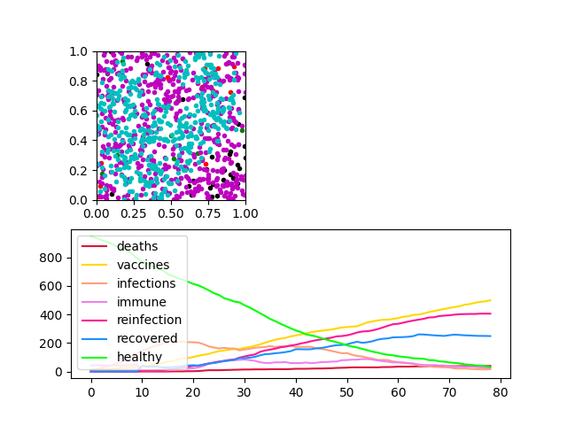
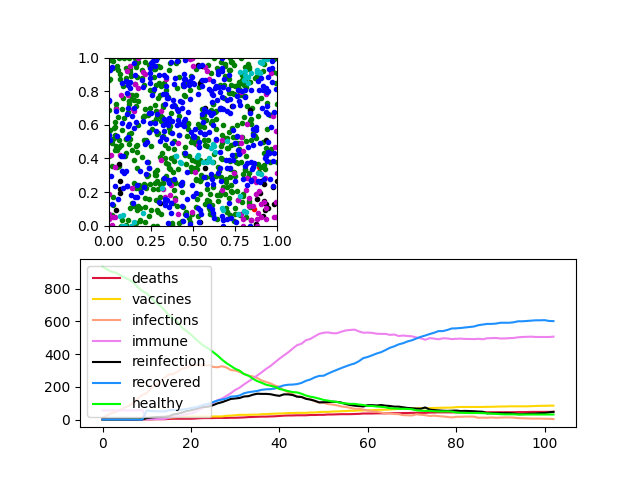
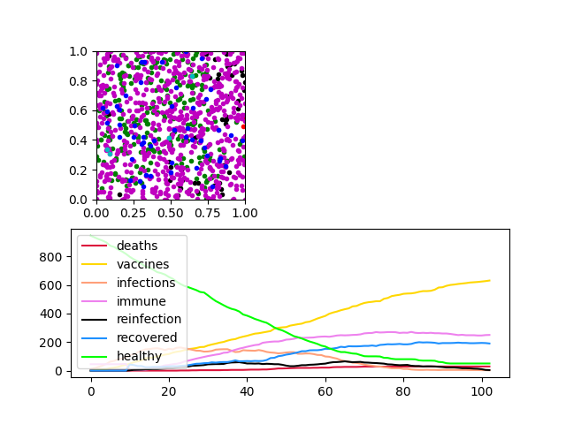
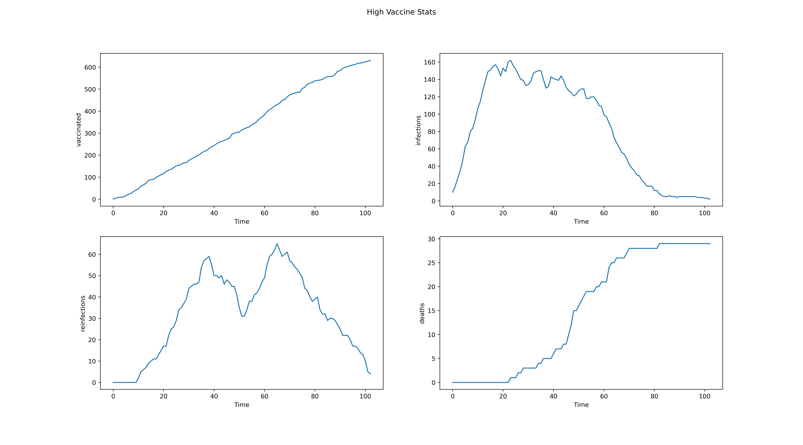
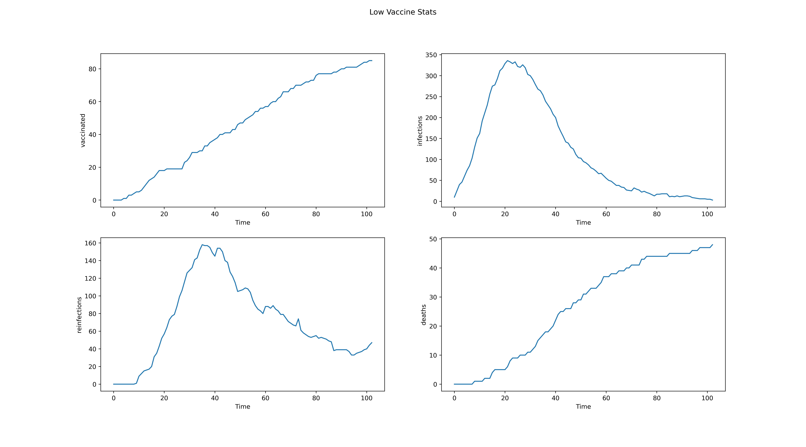
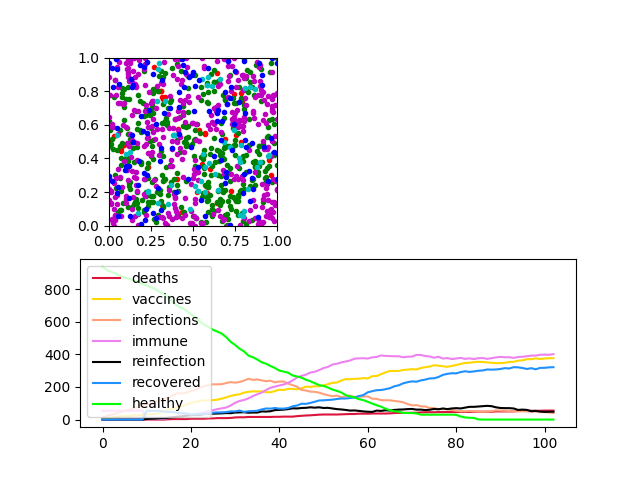
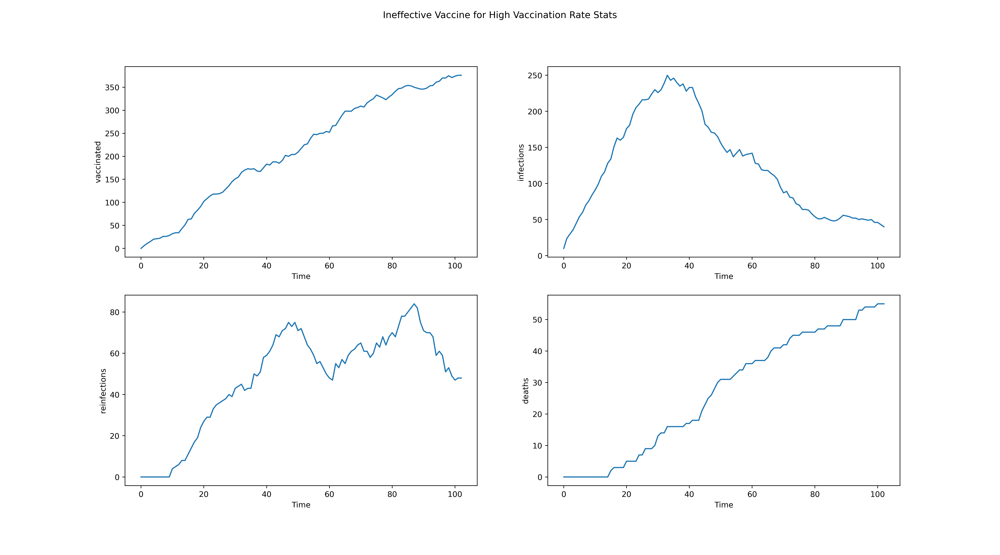

# Agent Based Model - Virus Spread

Grade 86%

## Introduction
This repository contains all the relevant code used to simulate a virus spread in a population and the effects different vaccination rates can have on a population, the number of reinfections that can occur and the number of deaths that can occur at varying levels of population immunity/vaccination. It is visualized and run using the PyCx framework found [here](https://github.com/hsayama/PyCX).

## Running the Simulation
To run the simulation we firstly clone this repository. We then change directory to this repo we just cloned and simply run the command:

```
python "assignment2-simulator.py"
```

This will then begin the simulation like all PyCx frameworks, with a tab for running and stopping the simulations alongside a visual of the agents and a plot of the variables we are tracking like so:



We can change the increments our model takes or close the window entirely to end the simulation. We can also adjust default parameters using the parameters tab on our PyCx simulator tab to start or stop simulations.

## Model Description

The following packages are required to run our model:

- Pylab
- PyCx
- re
- random (for sample of our population to move at each step)

For our simulation we are tracking multiple states. These are:

- ***healthy*** - This person is yet to be exposed to the virus and is not vaccinated / their vaccine efficacy has waned.
- ***vaccinated*** - This person has received the vaccine and is immune to the virus for a set amount of time as a result.
- ***immune*** - This person has been infected by the virus but has survived and now has immunity from the virus for a period of time.
- ***recovered*** - This person has had the virus and their immunity has since waned or they failed to develop immunity to the virus. In danger of being reinfected again but can be vaccinated now that their natural immunity is gone.
- ***infected*** - This person is actively infected by the virus and is in danger of spreading it to other agents who have no immunity or are not vaccinated.
- ***reinfected*** - This person has had the virus, their immunity has waned and they have now been reinfected by the virus. Less to die as a result of catching the virus again. They will have long lasting immunity if they survive.
- ***deaths*** - Here we track the number of agents who have died after contracting the virus.

The parameters for each agent are as follows:

- ***state*** - these are all outlined above (with exception of deaths) and change based on rules.
- ***immunity_time*** - the remaining amount of immunity (in steps) an agent has after surviving infection. Set as -1 if not actively infected.
- ***vaccine_efficacy*** - the amount of time an agent's vaccine is effective for before they are prone to infection again. Again, set to -1 if not applicable.
- ***infected_time*** - the amount of time an agent is infected for. Once this value hits 14 they are immune or recovered. Once again, set to -1 for non applicable agent states.
- ***x*** - the x co-ordinate of an agent with respect to the grid. Between 0 and 1.
- ***y*** - the y co-ordinates of an agent with respect to the grid. Between 0 and 1.

## Infection Rules

We start off with a population of 1000 agents and only a small selection of the population infected. The rules of infection are based on boundary detection. Firstly, we assign a radius that the agent would be prone to infection from if they encounter another agent. If the agents neighbours are within this boundary and this neighbour is infected then this agent also becomes infected. An agent can be infected for up to 14 steps. Within this timeframe they are still infectious to other agents they encounter. Once an agent's infection time is up there is a random chance of death and hence removal of this agent from the simulation. Otherwise, they develop immunity from the virus based on a random probability or are labelled as recovered and are hence vulnerable to infection again.

Agents can also become reinfected. If an agent has survived the virus and the immunity they developed from the virus has ceased to exist they can become infected again if they encounter an agent who is infected or reinfected and is within their radius for collision detection. Reinfected agents are much more prone to dying from the virus but if they survive they will have long lasting immunity as per the rules of the simulation. This attempts to mimic real-world virus infections where people can be reinfected again within a short timeframe but the chances of a third reinfection in a short period of time are remote. There is also a small chance of infection despite being vaccinated. If a vaccinated agent encounters an infected / reinfected agent they can be prone to infection but this has a small probability (this probability is adjustable but will be left very small to start).

## Movement Rules and Vaccination Rules

For our movement rules agents the movement is based on a uniform distribution. A random movement in the distribution boundary between +- our magnitude of movement (community_spread) is is taken and if values for x or y are above 1 for these the respective value is then labelled as 1. A random sample of agents is taken to move at each step. We take a random sample from half the size of the total population and within the range of this value we move a random number of numbers accordingly. This again mimics real world behaviour as not all agents (people) will be moving all the time throughout the stages of a virus spread like so. Vaccination rules follow a similar pattern. A randomly selected portion of the population who are either healthy or recovered from the virus are vaccinated and now have longer lasting immunity to the virus. As mentioned earlier, there is a slight chance they can get infected by the virus by their vaccine will protect them in most instances.

## Scenarios / Experiments

There was a selection of ideas I wanted to investigate in our virus spread simulation here. These included:

- the effects of a high vaccination rate in a population on preventing deaths / reinfections.
- the effects a low vaccination rate can have on a population's infections and deaths.
- the impact an effective vaccine has on preventing spread of the virus and vice versa.

We would model these scenarios from 0 to 100 steps and check the plots of our graphs over time at these instances. Firstly, let's look at a low vaccination uptake in the population and the effects it has on population deaths, infections and reinfections.

### Experiment 1 - Low Vaccination Rate

The parameters we ran for this experiment starting off were as follows:

- total_population = 1000
- infections = 10
- probability_infection = 0.95
- probability_immunity = 0.5
- probability_vacc_infection = 0.03
- probability_death = 0.05
- probability_reinfection_death = 0.2
- vaccinate_rate =  0.1 (***our low vaccination rate***)
- community_spread = 0.02

The full script for this trial and all parameters can be seen [here](https://gitlab.computing.dcu.ie/sweenk27/ca4024compmodels-assignment2/-/blob/master/experiments/low-vaccine-rate.py). Let's have a look at our outputs after approximately 100 steps of the simulation.




### Experiment 2 - High Vaccination Rate

The parameters we ran for this experiment starting off were the same as the previous experiment with the exception of:

- vaccinate_rate =  0.9 (***high vaccination rate***)

The full script for this can be found here [here](https://gitlab.computing.dcu.ie/sweenk27/ca4024compmodels-assignment2/-/blob/master/experiments/high-vaccine-rate.py). This was our output after 100 steps:



Looking at our plot it can be hard to differentiate between some values, particularly at the lower end. Let's compare and contrast our values for deaths, infections, reinfections and vaccinations in our two experiments thus far for a better understanding. Click on the images below to focus in on them for a clearer view. Relevant code for this analysis can be found [here](https://gitlab.computing.dcu.ie/sweenk27/ca4024compmodels-assignment2/-/blob/master/data-analysis/high-vaccine/analysis-high-vaccine.ipynb). All analysis uses the same script like the one shown here for different scenarios. 

High Vaccination Rate Stats Breakdown | Low Vaccination Stats Breakdown
--- | ---
 | 

Looking at the contrast in these key metrics we see the profound effect a high vaccine uptake has on a population. Looking at the number of deaths in the total population of 1000, we see the number of deaths after 100 steps at around 50 (and still rising) for a low vaccine uptake, whereas a high vaccine uptake sees deaths of approximately 30 which levels out after 80 steps and shows very little increases in this regard. There is also a notable impact on the number of reinfections in the population between these two scenarios. Both scenarios saw spikes of reinfections around the 30-40 step mark but there was a stark contrast in the scale of these spikes. A large vaccination rate saw a spike of approximately 65 active reinfections whereas the spike for a low vaccination rate saw a spike of approximately 150 active reinfections. Active infections see relatively similar patterns in peaks and falls, and similar scales to these numbers also. The difference in vaccine number is also huge here with over 600 being vaccinated by the 100th step for a high vaccination rate and approximately 80 for the same number of steps for a high vaccination rate. Without doubt our simulation here highlights the importance of effective vaccines here and vaccinating as many of the population that can be vaccinated quickly to prevent virus spread. This brings us to our next experiment.

### Experiment 3 - Ineffective Vaccine

With our previous experiments we had set the chance of infection when vaccinated to 0.03 (3% little to no chance). This implies an effective vaccine that protects agents well from exposure to the virus. With the coronavirus pandemic we saw exposure to multiple different vaccines such as Pfizer, Moderna, Astrazeneca and Janssen vaccines which all had differing efficacy rates in their clinical trials, some being more effective than others. Here I will test the impact of how a much higher chance of infection when vaccinated effects the population and see the impact it has on the same metrics we tracked before. We set our vaccination infection parameter like so:

- probability_vacc_infection = 0.4

The full script for this trial will be hosted [here](https://gitlab.computing.dcu.ie/sweenk27/ca4024compmodels-assignment2/-/blob/master/experiments/ineffective-vaccine.py). Here is a look at our outputs after approximately 100 steps:



Let's show some of our key metrics again:



Looking at this image compared to our results for experiment 2 we see the importance an effective vaccine has on preventing virus spread in a population. The difference in the number of deaths is stark here. There are over 50 deaths occurring here in the absence of an effective vaccine and looking at the graph for deaths here we see this trend is increasing steadily still. The numbers are very similar regarding deaths to a low vaccination rate, with a high effective vaccine (experiment 1) with the number of deaths seemingly more stark here than in experiment 1. The number of infections here is also higher, particularly toward the end of timeline covered presumably due to vaccinated agents encountering the virus and becoming infected. The number of reinfections is much smaller here than experiment 1 but this is most likely due to vaccinated agents becoming labelled as infected instead. The biggest takeaway here is despite an increasing trend of approximately 350 vaccinated agents after 100 steps in contrast to roughly 80 agents after a similar number of steps in our low vaccine rate experiment we see that the death rate can actually be higher in a population here with an ineffective vaccine being used on a population.
